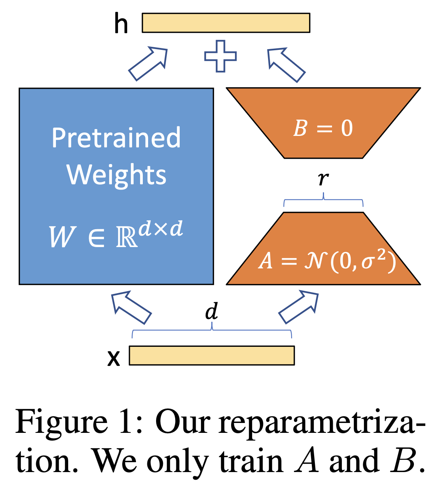

# Rinse My Gently, Part B: Finetune LLMs

This exercise is the second of two parts where we will get to experience the state-of-the-art workflow with AI and Python.

In today's exercise, our goal is to:
1. Set up a separate virtual environment for Part B (similar to Part A).
2. Understand how to fine-tune a language model using LoRA (Low-Rank Adaptation).
3. Experience how training data shapes a model's behavior and output.

We will be using **Cursor** (or VS Code), the same code editor from Part A. This exercise provides a focused demonstration of fine-tuning language models using LoRA, a technique that efficiently adapts pre-trained models to specific tasks or domains. You'll get hands-on experience training and testing language models with various text datasets.

*Note: If you're viewing this file in raw text format, use GitHub's web viewer or press `Cmd+Shift+V` (Mac) / `Ctrl+Shift+V` (Windows) in Cursor/VS Code to see the formatted version.*

---

## Table of Contents

- [Chapter 0 - Setting Up Python and Virtual Environment](#chapter-0---setting-up-python-and-virtual-environment)
- [Chapter 1 - Tuning Your First LLM](#chapter-1---tuning-your-first-llm)
  - [1.1 Load an LLM](#11-load-an-llm)
  - [1.2 Fine Tune Your First LLM](#12-fine-tune-your-first-llm)
  - [1.3 Run Fine Tuned LLM](#13-run-fine-tuned-llm)
  - [1.4 Repeat Fine Tune + Run Model with Data of Your Choice](#14-repeat-fine-tune--run-model-with-data-of-your-choice)
  - [1.5 Optional: Try a Better Base Model (Qwen)](#15-optional-try-a-better-base-model-qwen)
- [Chapter 2 - Questions and Explorations](#chapter-2---questions-and-explorations)

---

## Chapter 0 - Setting Up Python and Virtual Environment

This chapter provides a quick setup guide for Part B. If you completed Part A, you already know how to set up a virtual environment! We'll do the same thing here, but this time in the `AI_With_Python_PartB` folder.

**New to virtual environments, Python setup, or Git?**  
For detailed explanations of these concepts, see **Part A** (`AI_With_Python_PartA/Part_A_Instructions.md`). This chapter provides a brief summary assuming you understand the basics.

**Why a separate environment?**  
Part B uses different Python packages (such as `transformers` and `torch` for machine learning), so it needs its own isolated virtual environment.


### Step 1: Open the Part B Folder in Cursor

**Note:** If you are doing this as part of OIT 245, please make sure to re-download the [repository](https://github.com/kuangxu/rinse_me_gently) before starting Part B. This will ensure you have the most up to date files.


1. Open **Cursor** (or VS Code - see Part A for setup instructions if needed).
2. Click on **File** -> **Open Folder...**
3. Navigate to and select the **`AI_With_Python_PartB`** folder (not the root folder).
4. Click **Open**.

### Step 2: Open the Terminal

1. In Cursor, click **Terminal** -> **New Terminal**.
2. A panel will appear at the bottom of the screen.

### Step 3: Navigate to the Part B Folder (if needed)

Make sure you're in the `AI_With_Python_PartB` folder. If you just opened the folder in Cursor, you should already be there.

**How to check:** Type `pwd` (Mac) or `cd` (Windows) to see your current directory path.

### Step 4: Create the Virtual Environment

Type the following command and press **Enter**:

**For Mac:**
```bash
python3 -m venv venv
```

**For Windows:**
```bash
python -m venv venv
```

*For detailed explanation of virtual environments, see Part A, Part 3.*

### Step 5: Activate the Virtual Environment

Type the command for your system and press **Enter**:

**For Mac:**
```bash
source venv/bin/activate
```

**For Windows:**
```bash
.\venv\Scripts\activate
```

*Note: If you encounter activation errors on Windows, see Part A, Appendix C for troubleshooting.*

**How do I know it worked?**  
You should see `(venv)` at the beginning of your terminal prompt, like: `(venv) user@computer AI_With_Python_PartB %`

### Step 6: Install Required Packages

1. Make sure your terminal shows `(venv)` at the start.
2. Make sure you're in the Part B folder.
3. Type the following command and press **Enter**:
    ```bash
    pip install -r requirements.txt
    ```

*This installs PyTorch, Transformers, and other machine learning libraries. The installation may take several minutes, especially the first time.*

---

## Chapter 1 - Tuning Your First LLM

### 1.1 Load an LLM

Now that everything is set up, let's load and test a language model! We'll start with the "vanilla" (untrained) base model to see how it behaves before we fine-tune it.

*Concept: A **language model** is an AI that has been trained to predict the next word in a sequence. DistilGPT-2 (the baseline model we'll use) is a distilled version of GPT-2 that is faster and lighter while retaining core capabilities. You will see that this model produces semi-coherent sentences, but is really not yet very smart.*

#### Step 1: Test the Base Model

1. Make sure your terminal still shows `(venv)` at the start.
2. Make sure you're in the `AI_With_Python_PartB` folder.
3. Type the following command and press **Enter**:
    ```bash
    python run_model.py --use-raw --prompts-file data/shakespeare_prompts.json
    ```

*Explanation: The `--use-raw` flag tells the script to load the base DistilGPT-2 model without any fine-tuning. The `--prompts-file` flag specifies which test prompts to use. This is our "before" baseline - we'll compare this to the fine-tuned model later.*

4. Watch the output! The script will:
    - Load the DistilGPT-2 model
    - Run Shakespeare test prompts
    - Display the model's responses

**What to observe:** Notice how the model responds. It generates text, but it may not be particularly relevant or coherent for specific topics. This is expected - the model hasn't been trained on our custom data yet!

#### Step 2: Try Interactive Mode

Now let's have a conversation with the model! Interactive mode lets you type prompts and see responses in real-time.

1. In the same terminal (still with `(venv)` active), type:
    ```bash
    python run_model.py --use-raw --interactive
    ```

2. The script will load the model and then prompt you with `You: `.

3. Type a question or prompt and press **Enter**. For example:
    - "hi"
    - "sun is hot"
    - "my name is eve"

4. The model will generate a response and display it.

5. You can continue the conversation by typing more prompts.

#### Step 3: Exit Interactive Mode

When you're done experimenting, you can exit interactive mode in several ways:

**Method 1: Type a quit command**
- Type `quit`, `exit`, `bye`, or `q` and press **Enter**

**Method 2: Keyboard interrupt**
- Press `Ctrl+C` (Mac and Windows) to immediately exit

---

### 1.2 Fine Tune Your First LLM

Now for the exciting part - we'll fine-tune the model on custom data! We'll use the washing machine dataset to teach the model about washing machines.

*Concept: **Fine-tuning** adapts a pre-trained model to a specific task or domain. Instead of training from scratch, we use LoRA (Low-Rank Adaptation) to efficiently update just a small portion of the model's parameters. LoRA was introduced in 2021 by researchers at Microsoft and CMU as a way to fine-tune large language models without updating all billions of parameters. Instead, LoRA freezes the original model weights and adds small, trainable "adapter" matrices to specific layers. This approach can reduce trainable parameters by 10,000 times while maintaining similar performance. The key insight is that model adaptations can be represented in a low-dimensional space - think of it like making small adjustments to a complex system rather than rebuilding it from scratch. This is like giving a well-read person a specialized book - they already know language, but now they know more about this specific topic.*

<p align="center">
  
</p>

*Figure 1: LoRA reparametrization from the original paper. The pretrained weights W remain frozen, while only the small adapter matrices A and B are trained. Source: [LoRA: Low-Rank Adaptation of Large Language Models](https://arxiv.org/abs/2106.09685) (Hu et al., 2021)*

#### Step 1: Run the Fine-Tuning Script

1. Make sure your terminal still shows `(venv)` at the start.
2. Make sure you're in the `AI_With_Python_PartB` folder.
3. Type the following command and press **Enter**:
    ```bash
    python finetune_llm.py --data data/washingmachine_data.txt
    ```

*Explanation: This command tells the fine-tuning script to train the model using the washing machine dataset. The `--data` flag specifies which file to use for training.*

#### Step 2: Watch the Training Process

The script will:
1. Load the base DistilGPT-2 model
2. Prepare the washing machine data
3. Apply LoRA adapters (the efficient fine-tuning technique)
4. Train the model for several epochs using optimization (via a Stochastic Gradient Descent Algorithm)
5. Save the fine-tuned model to a folder

**What to expect:**
- You'll see progress bars showing training steps
- The script will display training metrics that look like this: `{'loss': 4.0596, 'grad_norm': 1.064, 'learning_rate': 0.000297, 'epoch': 2.86}`
  
  Here's what each term means:
  - **loss**: A measure of how wrong the model's predictions are (lower is better). You can think of loss as a form of objective function that measures how good a model is at predicting the training text that follows the prompt.
  - **grad_norm**: The size of the gradient (the direction and magnitude of parameter updates). This helps prevent the model from making updates that are too large, which could destabilize training. Values around 1.0 are typically good.
  - **learning_rate**: How big of steps the model takes when learning. A smaller learning rate (like 0.0003) means smaller, more careful steps. This is set automatically and decreases over time to help the model converge smoothly.
  - **epoch**: How many times the model has seen the entire training dataset. An epoch of 2.86 means the model has gone through the data almost 3 times. More epochs generally mean better learning, but too many can lead to overfitting.
- At the end, you'll see a message like: `Fine-tuned model saved to: ./fine_tuned_washingmachine_data_model`

*Note: The output folder name is automatically generated from your data file name. For `washingmachine_data.txt`, it creates `fine_tuned_washingmachine_data_model`. When you use a different data file (like `shakespeare_data.txt`), the folder name will automatically adapt (e.g., `fine_tuned_shakespeare_data_model`).*

---

### 1.3 Run Fine Tuned LLM

Now let's test our fine-tuned model and see how it compares to the base model! The fine-tuned model should be much better at generating text related to washing machines.

#### Step 1: Load the Fine-Tuned Model

1. Make sure your terminal still shows `(venv)` at the start.
2. Make sure you're in the `AI_With_Python_PartB` folder.
3. Type the following command and press **Enter**:
    ```bash
    python run_model.py --model-path ./fine_tuned_washingmachine_data_model --prompts-file data/shakespeare_prompts.json
    ```

*Explanation: This loads the fine-tuned model we just created. Notice we're NOT using `--use-raw` anymore - we want to use our customized model! The `--prompts-file` flag specifies which test prompts to use (the same Shakespeare prompts we used in section 1.1).*

4. The script will load the model and run the Shakespeare test prompts (the same ones it used with the base model in section 1.1).

**What to observe:** Compare these responses to what you saw in section 1.1. The fine-tuned model should generate more relevant and coherent text, especially when the prompts relate to the training data.

#### Step 2: Test with Washing Machine Prompts

Now let's use prompts specifically designed for washing machines:

1. In the same terminal, type:
    ```bash
    python run_model.py --model-path ./fine_tuned_washingmachine_data_model --prompts-file data/washingmachine_prompts.json
    ```

*Explanation: The `--prompts-file` flag tells the script to use a different set of test prompts. These prompts are specifically designed to test the model's knowledge about washing machines.*

2. Watch the output! The model should generate responses that are much more relevant to washing machines compared to the base model.

#### Step 3: Try Interactive Mode with Your Fine-Tuned Model

Let's have a conversation with our fine-tuned model:

1. Type the following command:
    ```bash
    python run_model.py --model-path ./fine_tuned_washingmachine_data_model --interactive
    ```

2. Try talking to the model! Compare the responses to what the base model would have said earlier. What differences do you notice? 

3. The model will generate responses and display them. You can continue the conversation by typing more prompts.

4. When you're done, type `quit`, `exit`, `bye`, or `q` to exit, or press `Ctrl+C`.

---

### 1.4 Repeat Fine Tune + Run Model with Data of Your Choice

Now that you've seen how fine-tuning works, try it with different datasets! The `data` folder contains several options:

- `eminen.txt` - Eminem lyrics
- `shakespeare_data.txt` - Shakespeare's works
- `washingmachine_data.txt` - Washing machine information (already used)

If you feel adventurous, try creating your own text file! Simply create a `.txt` file in the `data` folder with your own content, and use it just like the examples above.

*Concept: Different training data will teach the model different styles and knowledge. A model trained on Shakespeare will write in an old English style, while one trained on Eminem lyrics will have a very different tone and vocabulary.*

#### Step 1: Fine-Tune with Your Chosen Dataset

Repeat the fine-tuning process from section 1.2, but change the data file. For example, to use Shakespeare data:

```bash
python finetune_llm.py --data data/shakespeare_data.txt
```

**What changes:** Only the `--data` argument. The model will be saved to a folder based on your file name (e.g., `./fine_tuned_shakespeare_data_model`).

#### Step 2: Test Your New Fine-Tuned Model

Repeat the testing process from section 1.3, but use your new model's path:

```bash
python run_model.py --model-path ./fine_tuned_shakespeare_data_model --prompts-file data/shakespeare_prompts.json
```

**What changes:** Only the `--model-path` argument (and optionally the `--prompts-file` to match your training data).

---

### 1.5 Optional: Try a Better Base Model (Qwen)

You can also try using a more advanced base model called Qwen. This model is more capable than DistilGPT-2, but it runs a bit slower.

#### Step 1: Test the Qwen Base Model

Repeat step 1.1 from section 1.1, but use the Qwen model instead:

```bash
python run_model.py --use-raw --model-name qwen --prompts-file data/shakespeare_prompts.json
```

*Explanation: The `--model-name qwen` flag tells the script to use the Qwen model instead of DistilGPT-2. Qwen is a more recent and capable model, but it takes longer to load and generate responses.*

**What to observe:** Compare the responses from Qwen to what you saw with DistilGPT-2. The Qwen model should produce more coherent and relevant text, but you may notice it takes longer to generate responses.


## Chapter 2 - Questions and Explorations

1. After you have completed all steps above, discuss with your neighbors: What did you find most surprising versus least surprising? What did you learn about LLMs that you didn't know before from simply using an existing, consumer-facing LLM?

2. The fine-tuning of an LLM is in fact a great example of how simulation is used to optimize a heuristic. In the context of our lectures, can you explain at a high level what type of simulation is taking place here (what is random and uncertain)? Explain also what is the heuristic, objective function, and optimization being performed?

3. Open up the figure of the loss curve that was generated after you ran the fine-tuning script. What do you notice?

4. [This takes more time, recommend doing it offline] Time-permitting, open `config.py` and look for "TRAINING HYPERPARAMETERS". Try changing a few parameters (examples below) and see how it impacts fine-tuning and its final outcome:
   - `learning_rate`: Try values like `1e-4` (0.0001) or `1e-3` (0.001) - how does this affect training speed and final loss?
   - `num_train_epochs`: Try `2` or `3` instead of `1` - does more training improve the model?
   - `per_device_train_batch_size`: Try `4` or `16` instead of `8` - how does batch size affect training time and memory usage?


